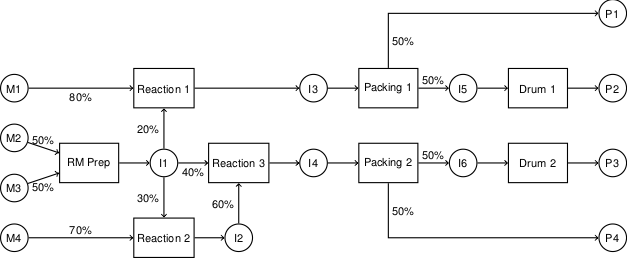
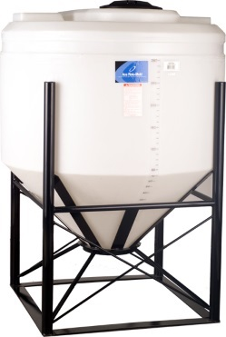

# [CBE30338](https://jckantor.github.io/CBE30338)

## Figure Index
* .DS_Store

* 02.05-Main-Lynx.jpg

* 03.03-GravityDrainedTanks.png

* 05.05-baroreflex.png

* 05.05-nrcardio.2015.96-f2.jpg

* 08.01-5-Figure1-1.png

* 08.01-Chu_2013.pdf

* 08.01-Chu_2013.png

* 08.01-Chu_2013.tex

* 08.01-Kondili_gantt.png

* 08.01-MarveliasGrossman2003a.pdf

* 08.01-MarveliasGrossman2003a.png

* 08.01-MarveliasGrossman2003a.tex

* 08.01-MarveliasGrossman2003b.pdf

* 08.01-MarveliasGrossman2003b.tex

* 08.01-Screen Shot 2017-09-19 at 8.15.10 AM.png

* 08.01-Screen Shot 2018-04-17 at 4.15.33 PM.png

* 08.01-State-task-network-representation-for-example-1.png

* 08.01-State-task-network-representation-for-example2.png

* 0B.99-515px-Honeywell_thermostat_open.jpg

* 0B.99-Inkbird-16-Manual.png

* 0B.99-Inkbird-16.png

* 0B.99-tclab_device.png

* 0B.99-TCLabOverview.pdf

* 0B.99-TCLabOverview.tex

* 220px-Chemostat_shematic.png

* 408px-Agitated_vessel.png

* ace_cb0345-52_345_gallon_cone_bottom_tank.jpg

* alcohol_stove.jpeg

* B.00-TCLabOverview.png

* B.01-FeedbackControlDiagram.png

* Continuous Mixed Tank.pdf

* Continuous Mixed Tank.png

* ControlLoop.png

* CruiseControl.png

* CruiseControl2.png

* E11-10.png

* E11-14.png

* FeedbackControlDiagram.pdf

* FeedbackControlDiagram.png

* FeedbackControlDiagram.tex

* InteractingTanks.png

* Internal_Model_Control.png

* LP_ProductX.pdf

* LP_ProductX.png

* LP_ProductX.tex

* LP_ProductXY.pdf

* LP_ProductXY.png

* LP_ProductXY.tex

* LP_ProductY.pdf

* LP_ProductY.png

* LP_ProductY.tex

* LPprob01.png

* nihms-475924-f0001.jpg

* Pharmaockinetics.png

* Pharmaockinetics1.png

* Pharmaockinetics2.png

* refinery_CEP.png

* REI_stove.jpeg

* Screen Shot Jupyter Session.png

* ThermocoupleResponse.png

